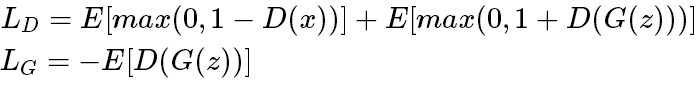

## Generative Adversarial Networks (GANs)

*Name* | *Paper Link* | *Value Function*
:---: | :---: | :--- |
**GAN** | [Arxiv](https://arxiv.org/abs/1406.2661) | 
**LSGAN**| [Arxiv](https://arxiv.org/abs/1611.04076) | 
**WGAN**| [Arxiv](https://arxiv.org/abs/1701.07875) | 
**WGAN-GP**| [Arxiv](https://arxiv.org/abs/1704.00028) | 
**DRAGAN**| [Arxiv](https://arxiv.org/abs/1705.07215) | 
**CGAN**| [Arxiv](https://arxiv.org/abs/1411.1784) | 
**infoGAN**| [Arxiv](https://arxiv.org/abs/1606.03657) | 
**ACGAN**| [Arxiv](https://arxiv.org/abs/1610.09585) | 
**EBGAN**| [Arxiv](https://arxiv.org/abs/1609.03126) | 
**BEGAN**| [Arxiv](https://arxiv.org/abs/1703.10717) |  
**Hinge Loss**| [Arxiv](https://arxiv.org/abs/1705.02894) | 
